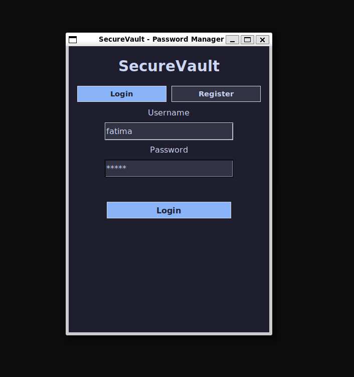
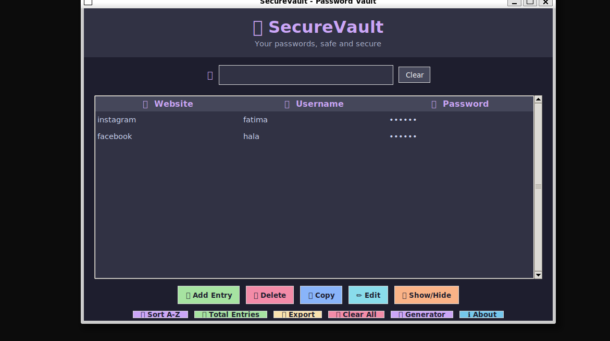
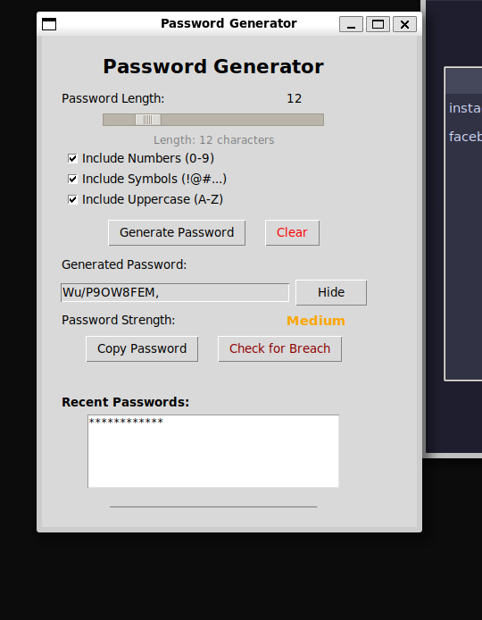
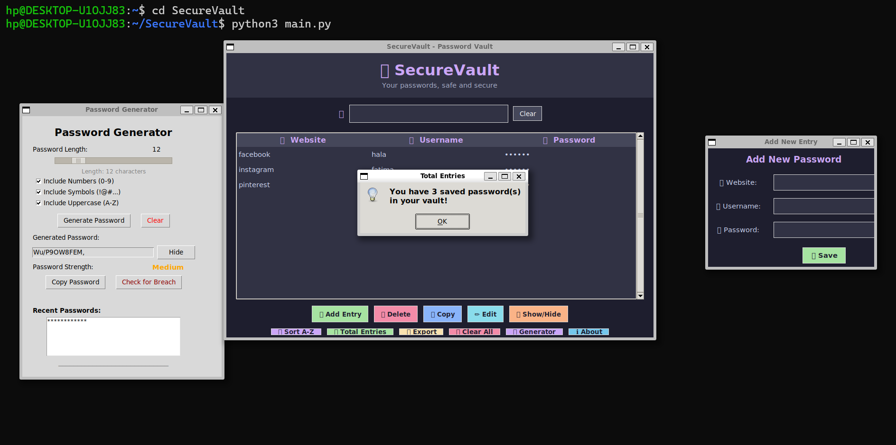

# SecureVault - Password Manager

A desktop password manager built with Python and Tkinter. Users can register, log in, save encrypted passwords, generate strong passwords, and check if a password has been leaked in a data breach.

## Tech Stack

- Frontend: Tkinter
- Backend: Python
- Database: SQLite
- Encryption: cryptography (Fernet)
- Breach Checking: HaveIBeenPwned API

## Project Structure
SecureVault/
├── main.py
├── README.md
├── securevault/
│   ├── database.py       # All database functions
│   ├── encryption.py     # Encrypt, decrypt, hash passwords
│   └── hibp.py           # Breach checking via HIBP API
## Setup Instructions

```bash
git clone https://github.com/Fatmah1211/SecureVault
cd SecureVault
pip install cryptography requests
python3 main.py
```

## Backend Functions (for group members)

### encryption.py
- `generate_key()` — run once at app startup
- `encrypt_password(plain)` — returns encrypted string
- `decrypt_password(encrypted)` — returns original password
- `hash_password(password)` — returns SHA256 hash
- `verify_password(password, hashed)` — returns True/False

### database.py
- `initialize_database()` — run once at app startup
- `register_user(username, password_hash)` — returns True/False
- `login_user(username, password_hash)` — returns user_id or None
- `save_password(user_id, website, username, encrypted_password, category)` — saves entry
- `get_passwords(user_id)` — returns list of all saved entries
- `delete_password(password_id)` — deletes an entry

### hibp.py
- `check_password_breached(password)` — returns breach count, 0 if clean, None if API error

## How to Use Backend in Your Screen

```python
from securevault.database import initialize_database, register_user, login_user
from securevault.encryption import generate_key, hash_password, encrypt_password, decrypt_password
from securevault.hibp import check_password_breached

# Run at startup
generate_key()
initialize_database()

# Register
register_user("username", hash_password("password"))

# Login
user_id = login_user("username", hash_password("password"))

# Save a password
encrypt_password("mypassword")

# Check breach
count = check_password_breached("password123")
```

## Team

| Member | Branch | Responsibility |
|--------|--------|---------------|
| Fatmah Tahir | backend + integration | Database, encryption, HIBP, merging |
| Fizzah Ahsan | login-screen | Login and register screen |
| Ayesha Noor  | vault-screen | Password vault screen |
| Maida Saleem | generator-screen | Password generator screen |
| Drakhshan Abbas | vault-screen-extras | Search, filter, categories |

## Screenshots
## Screenshots

### Login Screen


### Password Vault


### Password Generator


### Full App Overview


## Backend & API Explanation

### Encryption
All passwords are encrypted using Fernet symmetric encryption from the `cryptography` library before being stored in the SQLite database. A secret key is generated once and stored locally in `secret.key`. Even if someone accesses the database file directly, all passwords appear as unreadable encrypted strings.

### HaveIBeenPwned API
The app uses the HIBP k-anonymity model to check if a password has been leaked in known data breaches. Only the first 5 characters of the SHA1 hash of the password are sent to the API — the full password never leaves the device. The API returns all matching hashes and the app checks locally if the full hash appears in the results.

## GitHub Issues
- [Connect delete entry to backend database](https://github.com/Fatmah1211/SecureVault/issues/12)
- [Connect edit entry to backend database](https://github.com/Fatmah1211/SecureVault/issues/10)
- [Add category filter to vault screen](https://github.com/Fatmah1211/SecureVault/issues/11)

## Major Pull Requests
- [vault-screen base UI setup](https://github.com/Fatmah1211/SecureVault/pulls)
- [generator-screen base UI setup](https://github.com/Fatmah1211/SecureVault/pulls)
- [login-screen implementation](https://github.com/Fatmah1211/SecureVault/pulls)
- [backend + integration final merge](https://github.com/Fatmah1211/SecureVault/pulls)
